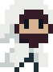

# SupaLidlGame

Forsen-related game

## Building

> [!IMPORTANT]
> This is currently being developed with a [custom branch of
> Godot](https://github.com/zaevi/godot/tree/fix_csharp_generic_reloading).
>
> Please apply this patch if building.

Requires .NET version >=7.0.

## Notes

The tilde key (`~`) can open the developer console. This allows access to
singletons --- an instance of `Utils.World` can be accessed through `World`,
and the player character can be accessed through `World.CurrentPlayer`.

The default starting scene is `res://Scenes/ArenaExterior.tscn`, and running a
non-map scene may spill out errors from `SupaLidlGame.Utils.World`. Eventually
this will be fixed to allow main menu scenes.

## Attributions

The FontStruction "calamity,"
(https://fontstruct.com/fontstructions/show/2158964) by "Doph" is licensed
under a Creative Commons Attribution license
(http://creativecommons.org/licenses/by/3.0/).

